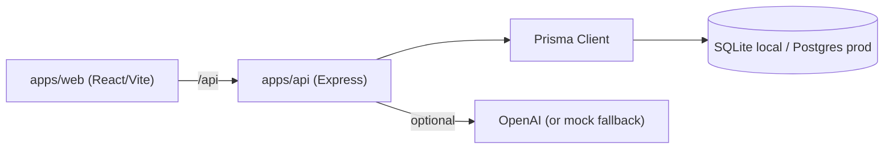
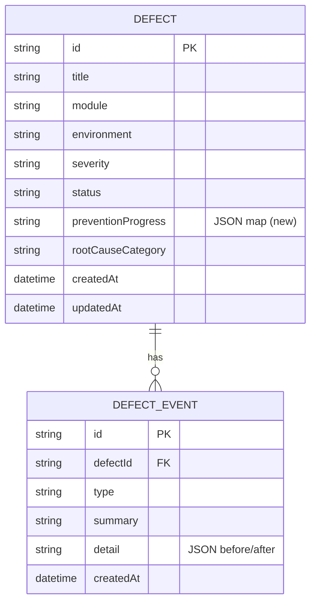

# Design: DefectLens Improvements

## Overview

This design extends the existing DefectLens MVP without rewriting it. The architecture stays as-is: an Express + Prisma API (`apps/api`), a React + Vite frontend (`apps/web`), and a shared Prisma schema (`prisma/`). The improvements add persistence for prevention progress, an audit trail, filtering/pagination, trend analytics, a release-readiness export, production-grade persistence, AI hardening, a notification system, automated tests, and presentation assets.

The guiding principle is incremental, independently shippable change. Each requirement maps to a discrete slice that can be implemented, verified, and demoed on its own.

## Architecture

Current shape (unchanged):



New and changed components:

- **Data model**: add `preventionProgress` to `Defect`; add a `DefectEvent` model for the audit trail.
- **API**: extend `GET /api/defects` with filtering, search, and pagination; add prevention-progress persistence; add audit recording; add trend metrics to the dashboard; add a release-readiness export endpoint.
- **Web**: filter/search controls and pagination on the list; persistent checklist with progress summary; trend charts on the dashboard; audit timeline on detail; export action; a global notification system.
- **Cross-cutting**: configurable database provider; AI prompt hardening; Vitest-based test suite.

## Components and Interfaces

### Data model changes (`prisma/schema.prisma`)

Add to `Defect`:

- `preventionProgress String?` — JSON-encoded map of `{ [actionText]: { done: boolean, updatedAt: string } }`. JSON-on-text is retained to match the existing pattern for analysis arrays and avoid a heavier migration; the tradeoff is documented.

New model `DefectEvent`:

- `id String @id @default(cuid())`
- `defectId String` (indexed; relation to `Defect`)
- `type String` — one of `STATUS_CHANGED`, `ANALYSIS_GENERATED`, `PREVENTION_UPDATED`, `CREATED`, `DELETED`
- `summary String` — human-readable description
- `detail String?` — JSON-encoded before/after payload
- `createdAt DateTime @default(now())`

A relation `events DefectEvent[]` is added to `Defect` with cascade delete so removing a defect cleans up its events.

### Database provider configuration (Requirement 7)

- Local development keeps `provider = "sqlite"` behavior driven by `DATABASE_URL`.
- For production Postgres, the Prisma datasource provider must match the connection string. Approach: keep a single schema and document switching the `provider` to `postgresql` for production builds, or introduce an environment-driven provider. Decision: use a documented provider value appropriate to the deployment target, validated at startup in `env.ts`.
- `env.ts` validates `DATABASE_URL` presence and shape at startup and fails fast with a clear message (Req 7.4).

### API: list filtering, search, pagination (Requirements 3, 8)

Extend `GET /api/defects` to accept query parameters, validated with a Zod query schema:

- `status`, `severity`, `module`, `environment` — optional exact-match filters.
- `q` — optional free-text term matched (case-insensitive `contains`) against `title`, `module`, `affectedCaseIds`.
- `page` (default 1), `pageSize` (default 20, capped at a max).

Response shape changes from a bare array to a paged envelope:

```json
{
  "items": [ /* DefectSummary[] */ ],
  "page": 1,
  "pageSize": 20,
  "total": 42,
  "totalPages": 3
}
```

Filtering is applied in the Prisma `where` clause; total is computed with `count` on the same `where` (Req 8.4). SQLite `contains` is case-insensitive for ASCII by default; the search design accepts that limitation for the demo dataset.

The web `api.ts` `listDefects` signature changes to accept a query object and return the envelope; `DefectListPage` is updated accordingly.

### API: prevention progress persistence (Requirement 1)

- New endpoint `PATCH /api/defects/:id/prevention` accepting `{ action: string, done: boolean }` or a full progress map. Decision: accept a single-action toggle payload `{ action, done }` for simplicity and to support per-action timestamps.
- Server loads current `preventionProgress`, updates the entry with `done` and `updatedAt`, persists, records a `PREVENTION_UPDATED` audit event, and returns the updated defect.
- On analysis regeneration, the analyze handler reconciles: keep progress entries whose action text still exists in the new `preventionActions`, drop the rest (Req 1.4).
- Serializer exposes `preventionProgress` as a typed object and a derived `{ completed, total }` summary for the UI (Req 1.5).

### API: audit trail (Requirement 5)

- A small helper `recordEvent(defectId, type, summary, detail?)` writes a `DefectEvent`. It is wrapped so a failure logs but does not throw into the primary request path (Req 5.5).
- Hook points: defect creation, status change in PATCH, analyze handler, prevention update, delete.
- New endpoint `GET /api/defects/:id/events` returns events newest-first. The detail page renders them as a timeline.

### API: dashboard trend metrics (Requirement 4)

Extend `GET /api/dashboard` response with:

- `createdPerWeek`: array of `{ weekStart: ISODate, count }` over the trailing N weeks.
- `closedPerWeek`: array of `{ weekStart: ISODate, count }` — "closed" approximated by defects whose status is `Closed` bucketed by `updatedAt` (documented approximation, since there is no dedicated closedAt; the audit trail can later provide exact close timestamps).
- `openByRootCause`: array of `{ category, count }` for non-closed defects.

Week bucketing uses a Monday-start ISO week computed in a shared util with unit tests (Req 4.4).

### API: release-readiness export (Requirement 6)

- New endpoint `GET /api/release-pack` returns a structured object: `generatedAt`, `summary` (counts, risk distribution, analysis coverage), and `defects` (filtered to open AND release risk High/Critical) each with root cause, release risk, prevention progress, CAB summary, rollback consideration.
- Frontend renders a dedicated, print-friendly view (`/release-pack`) with a browser-print/export action (Req 6.4). No qualifying defects yields an explicit empty pack (Req 6.5).

### API: AI prompt-injection hardening (Requirement 9)

- In `aiService.ts`, restructure the user message so defect fields are wrapped in explicit delimiters and labeled as untrusted data, with the system prompt instructing the model to treat delimited content as data only and never as instructions.
- Output validation against `analysisSchema` already exists and is retained; ensure no partial persistence on parse failure (Req 9.3, already enforced in `app.ts`).

### Web: notification system (Requirement 10)

- Add a lightweight context-based toast provider (`NotificationProvider`) wrapping the app in `App.tsx`, exposing `notify(type, message)`.
- Replace ad-hoc inline error strings in pages with `notify` calls for transient feedback; keep inline states for full-page load failures.
- Toasts stack, auto-dismiss after a short interval, and are manually dismissible (Req 10.3, 10.4).

### Web: defect detail enhancements

- Persistent checklist wired to `PATCH .../prevention`, with optimistic update and a completed/total badge.
- Audit timeline section consuming `GET .../events`.

### Testing (Requirement 2)

- Add `vitest` and `supertest` as dev dependencies in `apps/api`.
- Tests import the Express `app` directly (it is already exported) and run against an isolated SQLite test database via a test `DATABASE_URL` and a setup that pushes the schema and resets data between tests.
- Coverage: validation errors, 404 handling, mock analysis schema + classification rules, dashboard aggregation math, week-bucketing util, prevention reconciliation.
- Root `package.json` gains a `test` script delegating to the API workspace (Req 2.1).

### Presentation assets (Requirement 11)

- Capture screenshots into `docs/screenshots/` and reference them in the README.
- Add a headline outcome metric to the dashboard hero and the README.

## Data Models



## Error Handling

- Existing `HttpError` + `errorHandler` + `asyncHandler` pattern is reused for all new endpoints.
- Query parameter validation uses a Zod schema; invalid params yield a 400 with field details consistent with existing validation errors.
- Audit recording failures are caught and logged, never propagated (Req 5.5).
- AI parse failures continue to return `AI_PARSE_ERROR` 500 without persisting partial data.
- Frontend surfaces API errors via the notification system; full-page loads retain inline error cards.

## Testing Strategy

- **Unit**: week-bucketing util, mock analysis classification, prevention reconciliation, dashboard aggregation helpers.
- **Integration (API)**: CRUD validation, 404s, filtering/search/pagination envelope, prevention persistence, analyze flow with mock provider, dashboard and release-pack endpoints, using Supertest against the exported `app` with an isolated DB.
- **Manual/demo verification**: each phase is validated in the running app per the demo workflow before moving on.
- Tests must run from the repo root via a single `npm test` command and must not touch development data.

## Rollout / Sequencing

The tasks plan groups work into phases mirroring the requirements priority:

1. Credibility gaps: prevention persistence (R1), tests (R2), filtering (R3).
2. Governance: trends (R4), audit trail (R5), release pack (R6).
3. Hardening: Postgres-ready persistence (R7), pagination (R8), AI hardening (R9).
4. Polish: notifications (R10), presentation assets (R11).

Each phase is independently shippable and demoable.
