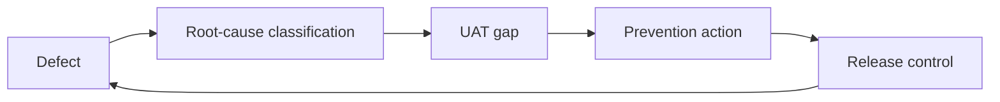

# DefectLens Product Brief

## Problem Statement

Traditional defect trackers capture symptoms, severity, and status, but they rarely preserve the delivery lesson. DefectLens reframes each defect as evidence of a possible requirements gap, design gap, UAT coverage gap, or release-control weakness.

## Target Users

- Technical Business Analysts
- Technical Product Owners
- Technical Project Managers
- UAT Leads
- Solution Delivery teams
- Release governance reviewers

## MVP Scope

The MVP allows users to create defects, view a triage queue, analyse root cause, generate prevention actions, generate missing UAT scenarios, and copy CAB-ready release summaries. It includes seeded fictional data so the dashboard is useful immediately after setup.

## More Than a Bug Tracker

DefectLens does not stop at "what broke." It asks why the defect happened, where similar risk may exist, what UAT coverage was missing, what preventive action should be added, and how the release risk should be communicated.

## Two-Axis Prevention Model

1. Root-cause classification: identify whether the defect points to requirements, design, development, configuration, data, integration, batch, regression, test coverage, user understanding, or release/deployment gaps.
2. Preventive delivery action: translate the classification into concrete requirements updates, UAT scenarios, regression checks, release controls, and CAB evidence.

## Prevention Loop

## Technical BA / Technical PM Value

For a Technical BA, DefectLens shows how defect evidence can improve acceptance criteria and UAT coverage. For a Technical PM, it shows how recurring defects can be converted into delivery controls, release-risk summaries, and governance-ready actions.
